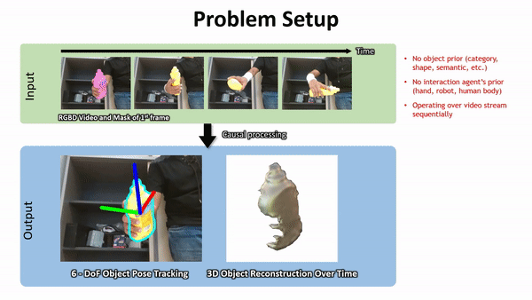
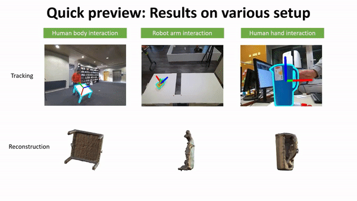
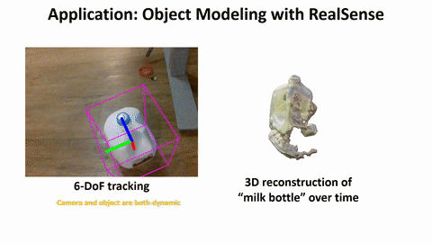

# BundleSDF: Neural 6-DoF Tracking and 3D Reconstruction of Unknown Objects

This is an implementation of our paper published in CVPR 2023

[[Arxiv](https://arxiv.org/abs/2303.14158)] [[Project page](https://bundlesdf.github.io/)] [[Supplemental video](https://www.youtube.com/watch?v=5PymzKbKv8w/)]

# Abstract
We present a near real-time method for 6-DoF tracking of an unknown object from a monocular RGBD video sequence, while simultaneously performing neural 3D reconstruction of the object. Our method works for arbitrary rigid objects, even when visual texture is largely absent. The object is assumed to be segmented in the first frame only. No additional information is required, and no assumption is made about the interaction agent. Key to our method is a Neural Object Field that is learned concurrently with a pose graph optimization process in order to robustly accumulate information into a consistent 3D representation capturing both geometry and appearance. A dynamic pool of posed memory frames is automatically maintained to facilitate communication between these threads. Our approach handles challenging sequences with large pose changes, partial and full occlusion, untextured surfaces, and specular highlights. We show results on HO3D, YCBInEOAT, and BEHAVE datasets, demonstrating that our method significantly outperforms existing approaches.






# Bibtex
```bibtex
@InProceedings{bundlesdfwen2023,
author        = {Bowen Wen and Jonathan Tremblay and Valts Blukis and Stephen Tyree and Thomas M\"{u}ller and Alex Evans and Dieter Fox and Jan Kautz and Stan Birchfield},
title         = {{BundleSDF}: {N}eural 6-{DoF} Tracking and {3D} Reconstruction of Unknown Objects},
booktitle     = {CVPR},
year          = {2023},
}
```

# Data download
- Download pretrained [weights of segmentation network](https://drive.google.com/file/d/1MEZvjbBdNAOF7pXcq6XPQduHeXB50VTc/view?usp=share_link), and put it under
`./BundleTrack/XMem/saves/XMem-s012.pth`

- Download pretrained [weights of LoFTR outdoor_ds.ckpt](https://drive.google.com/drive/folders/1xu2Pq6mZT5hmFgiYMBT9Zt8h1yO-3SIp), and put it under
`./BundleTrack/LoFTR/weights/outdoor_ds.ckpt`

- Download HO3D data. We provide the augmented data that you can download [here](https://drive.google.com/drive/folders/1Wk-HZDvUExyUrRn7us4WWEbHnnFHgOAX?usp=share_link). Then download YCB-Video object models from [here](https://drive.google.com/file/d/1-1m7qMMyUHYLhaRiQBbsSRMt5dMRX4jD/view?usp=share_link). Finally, make sure the structure is like below, and update your root path of `HO3D_ROOT` at the top of `BundleTrack/scripts/data_reader.py`
  ```
  HO3D_v3
    ├── evaluation
    ├── models
    └── masks_XMem
  ```


# Docker/Environment setup
- Build the docker image (this only needs to do once and can take some time).
```
cd docker
docker build --network host -t nvcr.io/nvidian/bundlesdf .
```

- Start a docker container the first time
```
cd docker && bash run_container.sh

# Inside docker container, compile the packages which are machine dependent
bash build.sh
```

# Run on your custom data
- Prepare your RGBD video folder as below (also refer to the example milk data). You can find an [example milk data here](https://drive.google.com/file/d/1akutk_Vay5zJRMr3hVzZ7s69GT4gxuWN/view?usp=share_link) for testing.
```
root
  ├──rgb/    (PNG files)
  ├──depth/  (PNG files, stored in mm, uint16 format. Filename same as rgb)
  ├──masks/       (PNG files. Filename same as rgb. 0 is background. Else is foreground)
  └──cam_K.txt   (3x3 intrinsic matrix, use space and enter to delimit)
```

Due to license issues, we are not able to include [XMem](https://github.com/hkchengrex/XMem) in this codebase for running segmentation online. If you are interested in doing so, please download the code separately and add a wrapper in `segmentation_utils.py`.

- Run your RGBD video (specify the video_dir and your desired output path). There are 3 steps. Note we assume the max relevant depth in the demo data <1. If this is not the case for you, change it [here](https://github.com/NVlabs/BundleSDF/blob/master/BundleTrack/config_ho3d.yml#L16)
```
# 1) Run joint tracking and reconstruction. 
python run_custom.py --mode run_video --video_dir /home/bowen/debug/2022-11-18-15-10-24_milk --out_folder /home/bowen/debug/bundlesdf_2022-11-18-15-10-24_milk --use_segmenter 1 --use_gui 1 --debug_level 2

# 2) Run global refinement post-processing to refine the mesh
python run_custom.py --mode global_refine --video_dir /home/bowen/debug/2022-11-18-15-10-24_milk --out_folder /home/bowen/debug/bundlesdf_2022-11-18-15-10-24_milk   # Change the path to your video_directory

# 3) (Optional) If you want to draw the oriented bounding box to visualize the pose, similar to our demo
python run_custom.py --mode draw_pose --out_folder /home/bowen/debug/bundlesdf_2022-11-18-15-10-24_milk
```

- Finally the results will be dumped in the `out_folder`, including the tracked poses stored in `ob_in_cam/` and reconstructed mesh with texture `textured_mesh.obj`.




# Run on HO3D dataset
```
# Run BundleSDF to get the pose and reconstruction results
python run_ho3d.py --video_dirs /mnt/9a72c439-d0a7-45e8-8d20-d7a235d02763/DATASET/HO3D_v3/evaluation/SM1 --out_dir /home/bowen/debug/ho3d_ours

# Benchmark the output results
python benchmark_ho3d.py --video_dirs /mnt/9a72c439-d0a7-45e8-8d20-d7a235d02763/DATASET/HO3D_v3/evaluation/SM1 --out_dir /home/bowen/debug/ho3d_ours
```


# Acknowledgement

We would like to thank Jeff Smith for helping with the code release. Marco Foco and his team for providing the test data on the static scene.


# Contact
For questions, please contact Bowen Wen (bowenw@nvidia.com)
